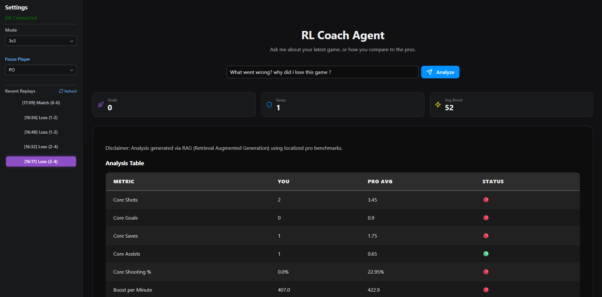
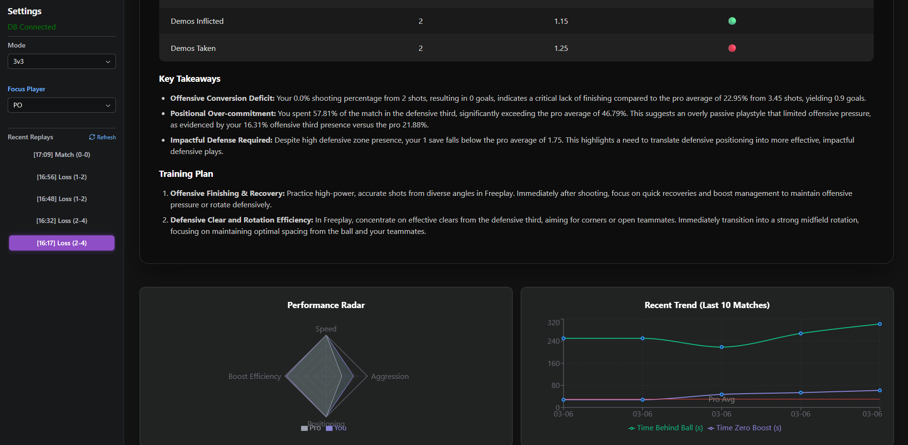

# 🏎️ RL Coach Agent - RAG-Powered Performance Analytics

> **An intelligent coaching system using Retrieval Augmented Generation (RAG) to provide fact-based tactical insights for competitive Rocket League players.**

---

## 📸 Project Overview

### Dashboard

### Dashboard

## 📺 Video Demo
[Watch the RL Coach Agent in action](https://www.youtube.com/watch?v=XF85Hh900gc)

---

## 🧠 The Architecture: Why RAG?

This project addresses the common issue of **LLM hallucinations** by implementing a structured **RAG (Retrieval Augmented Generation)** pipeline. Instead of relying on general pre-trained knowledge, the agent grounds its coaching on verifiable, localized data:

1.  **Retrieval**: Extracts raw performance metrics (boost management, positioning, speed) from a local **PostgreSQL** database.
2.  **Augmentation**: Calculates real-time **Pro Benchmarks** (based on professional competitive replay libraries) to enrich the AI context.
3.  **Generation**: **Gemini 1.5 Flash** generates a technical diagnostic based *exclusively* on the injected data, ensuring factual and actionable feedback.

---

## 🚀 Key Features

* **Context-Aware Filtering**: Automatically isolates metrics and benchmarks by game mode (2v2 vs 3v3).
* **Advanced Visualizations**: Comparative Radar Charts and historical trend analysis tracking improvement over time.
* **Real-time Monitoring**: A dedicated "watcher" script detects and ingests new replay files instantly from the game directory.
* **Data-Driven Training**: Generates specific technical drills and Freeplay focus areas based on detected performance gaps.
* **Discipline-Focused UI**: Minimalist, high-contrast dark mode interface designed for quick post-match reviews.

---

## 🛠 Tech Stack

* **AI / LLM**: Gemini 1.5 Flash (RAG Architecture)
* **Backend**: Python, FastAPI
* **Database**: PostgreSQL (Dockerized)
* **Frontend**: Reflex (React-based framework)
* **Data Viz**: Plotly / Recharts
* **Package Management**: uv

---

## ⚙️ Setup & Installation

### 1. Prerequisites
* Docker & Docker Compose
* Python 3.12+ (using `uv` is recommended)

### 3. Running the app
1.  **Start database**:
docker compose up -d

2.  **Start replays watcher**:
uv run python src/tools/replay_watcher.py

3.  **Start Reflex interface**:
uv run reflex run
